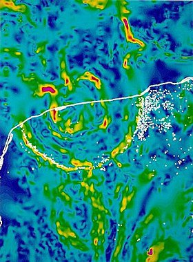
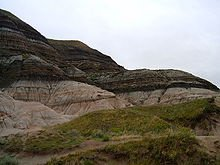
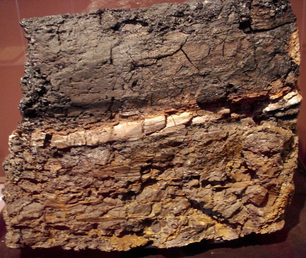

*Réponse publiée [sur Quora](https://fr.quora.com/Quelles-sont-les-vraies-causes-derri%C3%A8re-la-disparition-des-dinosaures/answer/Dr-Goulu)*

effectivement, la "chute des étoiles" est très irraisonnable.

Mais des fois il faut mettre sa raison de côté et regarder les faits.

Il y a 66 038 000 ans ± 11 000 ans (mesure par [Datation radiométrique](w:)) , quelque chose a fait [ça](w:Cratère_de_Chicxulub):

(mesure par [Gravimétrie](w:) la ligne blanche est la côte mexicaine, les points blancs sont des [Cénotes](w:Cénote) curieusement disposés en cercles et reliés entre eux par des grottes de fracture)

D'autre part on trouve partout sur Terre des roches comme celle là :

qui on toutes environ 66 millions d'années et où, en regardant de plus près la limite on trouve à peu près ça :

où la couche du milieu contient, suivant les endroits :

- du [quartz choqué et autres impactites](w:Impactite)
- du charbon d'arbres cramés
- de l'argile et autres dépôts typiques d'un tsunami, et ceci à des centaines de km à l'intérieur des côtes de l'époque
- et de l'iridium, cent fois plus que dans les roches du dessous et du dessus, mais très abondant dans les météorites.

Voilà, maintenant que vous avez les faits, il ne reste plus qu'à trouver le coupable.

Un tout petit bout de crachat d'étoile de 10 à 80 km est quand même très suspect. En fait il n'y a pas d'autre suspect pour les 4 caractéristiques des roches ci-dessus.

Peut-être bien que des volcans réveillés par hasard ou par l'impact ont provoqué des [Hivers volcaniques](w:Hiver_volcanique) qui ont empiré l'[Hiver d'impact](w:), tuant par la faim et le froid les dernières grosses bêtes qui n'avaient pas été cramées par les incendies ou balayées par les tsunami, mais très gros impact il y a eu.

Seules les petites bêtes réfugiées dans leurs terriers avec des graines, les indestructibles insectes, les insectivores et les animaux marins ont survécu.

Si vous ne trouvez pas ça raisonnable, vous avez raison. Ca ne l'est pas, mais c'est ce que les faits prouvent.

Moralité : méfiez-vous de votre raison.
