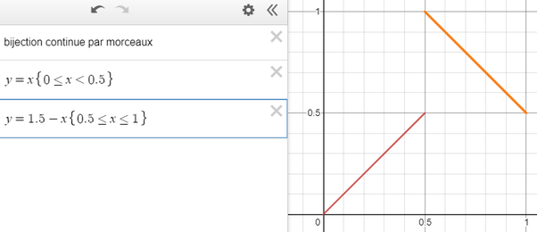

*Réponse publiée [sur Quora](https://fr.quora.com/Existe-t-il-une-fonction-f-bijective-de-01-dans-01-et-continue-par-morceaux-avec-un-nombre-fini-de-discontinuit%C3%A9s/answer/Dr-Goulu)*

Si vous vouliez dire de [0,1] fermé dans ]0,1[ ouvert, alors non : puisque les deux ensembles de correspondent pas, il ne peut y avoir bijection.

(edit après commentaire de [Jean-Roch Malassingne](https://fr.quora.com/profile/Jean-Roch-Malassingne) : mon argument est faux, mais je ne vois pas comment ce serait possible pour n'importe quelle fonction …)

Sinon il y en a une infinité, par exemple

merci pour la question qui m'a permis de découvrir

[https://www.desmos.com/](https://www.desmos.com/)
