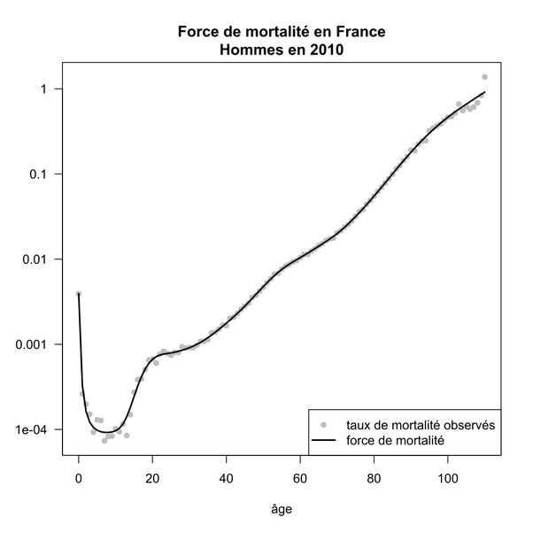

*Réponse publiée [sur Quora](https://fr.quora.com/Statistiquement-combien-de-fois-aurais-je-pu-mourir-dans-ma-vie-enti%C3%A8re/answer/Dr-Goulu)*

toutes les minutes environ ;-)

votre question n'est pas claire, mais voici une façon d'y répondre quand même.

La courbe de [Force de mortalité](w:)

donne la probabilité de mourir à chaque âge. En l'intégrant (et en inversant) on obtient la courbe de survie, qui donne la proportion des gens survivant à chaque âge.

La figure ci-dessous montre la courbe actuelle (en noir) et sa fantastique évolution depuis 250 ans :

(Source : [DemoGoT - Courbes de survie](https://www.demographie-got.com/demo_courbes.html) )

On y voit notamment la quasi élimination de la mortalité infantile qui tuait 1 enfant sur deux avant 8 ans en 1745, en encore près de un sur 4 en 1900.

Si les conditions de vie se maintiennent, un enfant né en 2015 a une chance sur deux de vivre jusqu'à 88 ans. C'est plus que l'[Espérance de vie](w:Espérance_de_vie_humaine) actuelle (82.7 ans en France) parce que le [calcul de l'espérance de vie](/2007/06/26/statistiques-et-esperance-de-vie/) se fait un peu différemment.

Mais en gros voilà, vous pouvez utiliser la courbe ci-dessus à peu près comme ça : si vous avez 20 ou 25 ans, vous n'avez eu qu'environ 1% de risque de mourir jusqu'ici. Moi j'en suis à 5%, et à 70 ans, vous avez déjà surmonté 10% des risques ;-)

Ce n'est qu'à 88 ans que vous pouvez vous dire que vous avez évité la majorité des risques :-)
