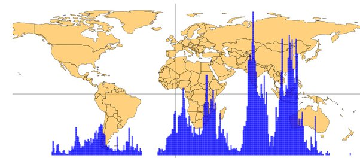

*Réponse publiée [sur Quora](https://fr.quora.com/Quel-est-le-fuseau-horaire-avec-le-moins-de-gens/answer/Dr-Goulu)*

Cette carte confirme les autres reponses

Source et version interactive ici :

[https://engaging-data.com/popula...](https://engaging-data.com/population-latitude-longitude/)
