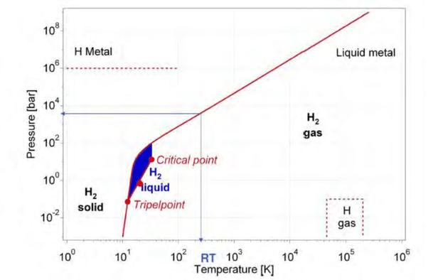

*Réponse publiée [sur Quora](https://fr.quora.com/Est-ce-que-l-hydrog%C3%A8ne-est-un-gaz/answer/Dr-Goulu)*

Dans une assez grande plage de température et de pression oui.

Mais comme (presque) toutes les matières, il peut être aussi solide ou liquide.
