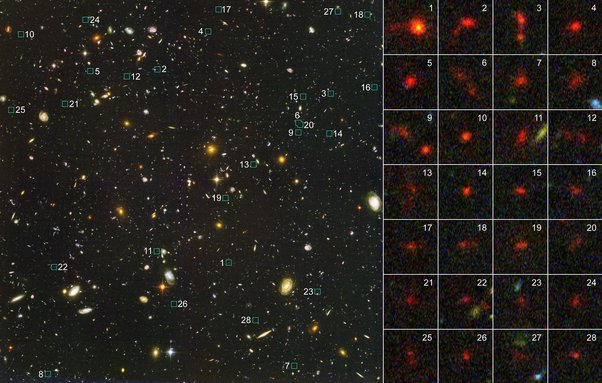

*Réponse publiée [sur Quora](https://fr.quora.com/Si-je-vais-tout-droit-dans-nimporte-quelle-direction-dans-lunivers-quelle-est-la-probabilit%C3%A9-que-je-me-cogne-%C3%A0-quelque-chose/answer/Dr-Goulu)*

Quasi nulles. Regardez le ciel la nuit : il est noir. Il faudrait vraiment la poisse pour arriver pile sur un de ces petits points brillants, et encore plus la poisse pour heurter une de ces petites sphères rondes qui orbitent autour.

Bon, quand on regarde vraiment bien jusqu'au bord de l'univers observable (qu'on ne peut même plus atteindre en partant maintenant à la vitesse de la lumière) on obtient les images du [Champ ultra-profond de Hubble](w:) qui ressemblent à ça :

Et on se dit qu'il y a quand même pas mal de trucs dans l'espace. Chacun de ces points est une galaxie, donc à peu près aussi vide que la notre. En arrivant dans une galaxie (ce qui est en effet assez probable, peut être 1% en regardant l'image ci-dessus) vous aurez environ autant de malchance de toucher quelque chose de plus gros qu'une poussière que dans notre galaxie.
