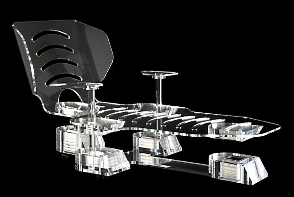

*Réponse publiée [sur Quora](https://fr.quora.com/Pouvez-vous-me-montrer-des-objets-cool-pas-forc%C3%A9ment-pratiques-qu-on-a-fabriqu%C3%A9s-avec-des-aimants/answer/Dr-Goulu)*

Chaise longue à lévitation magnétique de Hoverit. $13'336 seulement. Hélas l’entreprise n'a plus l'air d'exister…
