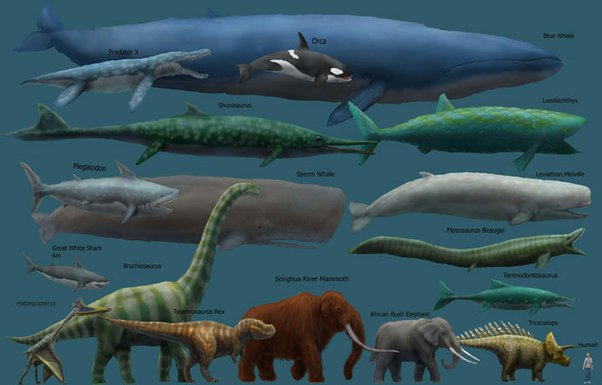

*Réponse publiée [sur Quora](https://fr.quora.com/Pourquoi-en-g%C3%A9n%C3%A9ral-les-organismes-vivants-du-pal%C3%A9ozo%C3%AFque-et-du-m%C3%A9sozo%C3%AFque-%C3%A9taient-ils-beaucoup-plus-grands-qu-%C3%A0-l-%C3%A9poque-actuelle/answer/Dr-Goulu)*

Ils ne l'étaient pas. Seules quelques espèces étaient plus grands que les animaux actuels à certaines époques, et toutes étaient plus petites que notre baleine bleue.

