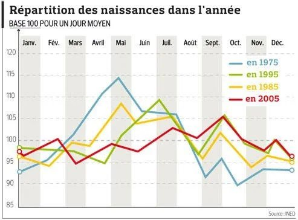

*Réponse publiée [sur Quora](https://fr.quora.com/Quel-est-le-signe-astrologique-le-plus-rare-en-France/answer/Dr-Goulu)*

Ça n'a rien à voir avec l'astroconnerie, mais il y a statistiquement un peu moins de naissances en décembre et janvier que le reste de l'année, donc tous les signes astromachins ne sont pas équiprobables.

(Source : Figaro [Les Français font des bébés tout au long de l'année](https://www.google.com/amp/s/amp.lefigaro.fr/actualite-france/2010/07/07/01016-20100707ARTFIG00628-les-francais-font-des-bebes-tout-au-long-de-l-annee.php))
