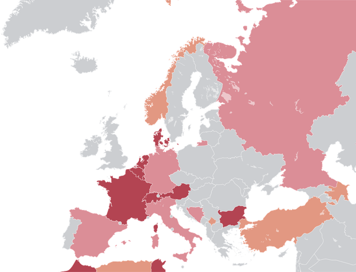

*Réponse publiée [sur Quora](https://fr.quora.com/Comment-le-monde-musulman-a-t-il-r%C3%A9agi-%C3%A0-la-d%C3%A9cision-de-la-Suisse-dinterdire-le-port-du-voile-int%C3%A9gral/answer/Dr-Goulu)*

La Suisse n'interdit pas le port du voile intégral, elle interdit de se dissimuler le visage, suite à une [initiative populaire](w:Initiative_populaire_en_Suisse) dont le texte est le suivant[[1]](#ALZPP):

> *Art. 10a*Interdiction de se dissimuler le visage
>
>
>
> 1 Nul ne peut se dissimuler le visage dans l’espace public, ni dans les lieux accessibles au public ou dans lesquels sont fournies des prestations ordinairement accessibles par tout un chacun; l’interdiction n’est pas applicable dans les lieux de culte.
>
>
>
> 2 Nul ne peut contraindre une personne de se dissimuler le visage en raison de son sexe.
>
>
>
> 3 La loi prévoit des exceptions. Celles-ci ne peuvent être justifiées que par des raisons de santé ou de sécurité, par des raisons climatiques ou par des coutumes locales.

Cette loi est très similaire à la [Loi interdisant la dissimulation du visage dans l'espace public](w:)française et à celles en vigueur dans d'autres pays (en rouge sur cette carte) ou au niveau local (en rose)

Notes de bas de page

[[1]](#cite-ALZPP)[Droits politiques](https://www.bk.admin.ch/ch/f/pore/vi/vis465t.html)
