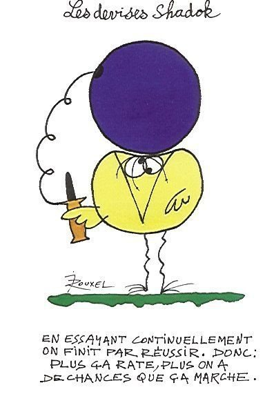

*Réponse publiée [sur Quora](https://fr.quora.com/Est-il-plausible-de-consid%C3%A9rer-que-les-puits-gravitationnels-engendr%C3%A9s-par-les-tous-les-trous-noirs-de-l-Univers-se-rejoignent-en-un-m%C3%AAme-point-point-qui-finirait-par-exploser-%C3%A0-la/answer/Dr-Goulu)*

La physique ne fonctionne pas en énumérant des idées jusqu'à ce qu'une se révèle exacte par hasard. On part d'observations expérimentales, et il y en a plein qui ne collent pas avec votre scénario : le Big Bang n'est pas une explosion, les "points" n'explosent pas, et si elles existent, les singularités des trous noirs ne sont pas des points mais des anneaux à cause du moment cinétique.

Bref non, pas plausible du tout. Mais dans le genre il y a la [Sélection naturelle cosmologique](w:)de Smolin, si ça vous intéresse.

