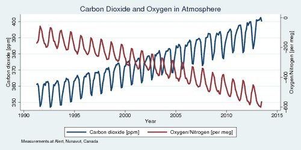

*Réponse publiée [sur Quora](https://fr.quora.com/Quel-risque-de-baisse-doxyg%C3%A8ne-avec-la-consommation-des-futures-voitures-%C3%A0-hydrog%C3%A8ne/answer/Dr-Goulu)*

Aucun si on produit l'hydrogène par électrolyse de l'eau, puisque cette électrolyse dégage aussi exactement la quantité d'oxygène qui sera recombinée à l'hydrogène dans la pile à combustible. (2 H2O <-> O2 + 2H2)

Et si on [produit l'hydrogène](w:Production_d'hydrogène) (comme maintenant à 96%…) par reformage des combustibles fossiles (en séquestrant le CO2 produit à l'usine…) alors l'oxygène de l'atmosphère continuera à baisser comme actuellement sous l'effet des combustibles fossiles, mais c'est négligeable.

(augmentation du CO2 et diminution du rapport O2/N2 selon [[1]](#kMDQj) )

[https://argonautes.club/une-dimi...](https://argonautes.club/une-diminution-de-la-concentration-en-oxygene-de-l-atmosphere-est-elle-a-craindre.html)

Notes de bas de page

[[1]](#cite-kMDQj)[Fossil fuels and declining oxygen in our atmosphere](https://wernerantweiler.ca/blog.php?item=2015-06-01)
