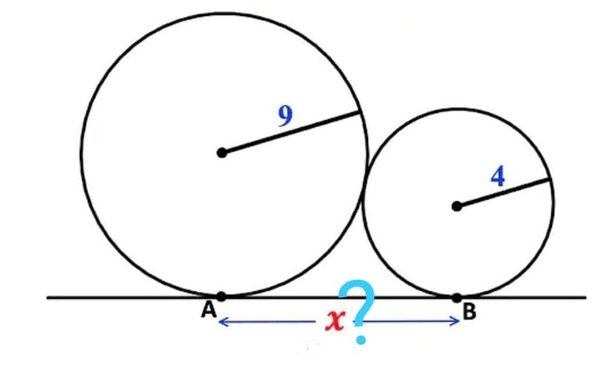

*Réponse publiée [sur Quora](https://fr.quora.com/Quelle-est-la-valeur-de-X-sur-ce-probl%C3%A8me/answer/Dr-Goulu)*

Je rappelle le problème :

le segment entre les centres a une longueur d=9+4

et il fait un angle alpha avec l'horizontale tel que d.sin(alpha)=4–9

donc alpha = arcsin(-5/13)

finalement x=(9+4).cos(alpha)

donc x=13.cos(arcsin(-5/13))

ce qui fait très exactement x=12 pour une raison trigonométrique qui m'échappe momentanément ;-)
