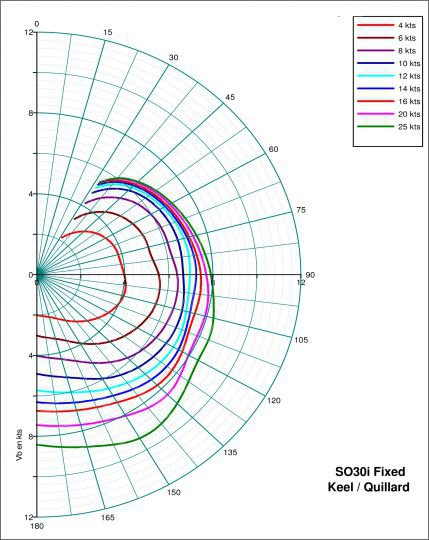
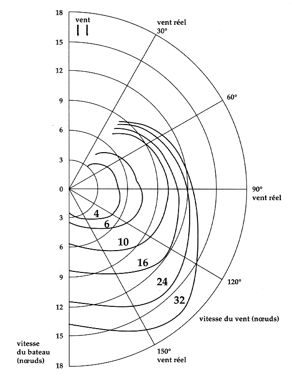

*Réponse publiée [sur Quora](https://fr.quora.com/Un-voilier-monocoque-qui-ne-d%C3%A9jauge-pas-peut-il-aller-plus-vite-que-le-vent/answer/Dr-Goulu)*

Oui, par vent faible.

Vous pouvez le voir sur des courbes "polaires de vitesse", par exemple celle-ci dessous d'un quillard (un Sun Odyssey 30, "petit" bateau de croisière):

(source : [Performance : Qu'est-ce qu'une polaire de vitesse ?](https://www.bateaux.com/article/30727/performance-qu-qu-une-polaire-de-vitesse-8201) )

Vous voyez qu'avec 4 nœuds de vent (courbe rouge à l'intérieur), le bateau dépasse très légèrement les 4 nœuds de vitesse lorsqu'il navigue à environ 100° du vent.

Avec un bateau plus grand ([Cigale 16 mètres](http://finot.com/bateaux/batproduction/alubat/cigale16/cigal16.htm) de Finot), on voit qu'on peut dépasser la vitesse du vent jusque vers 10 nœuds, et sur une plage plus large pour les vents faibles : avec 6 nœuds de vent, la Cigale avance à plus de 6 nœuds entre 60° et 130° environ.

