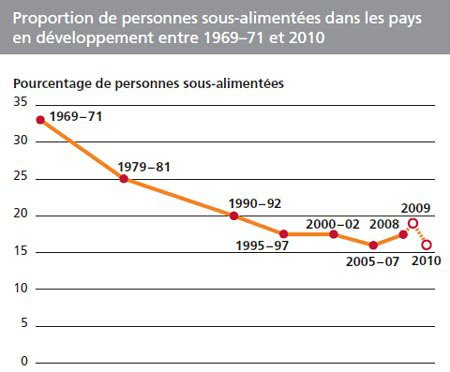

*Réponse publiée [sur Quora](https://fr.quora.com/Des-gens-meurent-de-faim-Les-riches-sont-il-des-meurtriers/answer/Dr-Goulu)*

Dans ce cas c'est pas nouveau , voir [Liste de famines — Wikipédia](w:Liste_de_famines)

et la plus meurtrière de l'histoire est la [Grande famine en Chine](w:)de 1959 à 1961 qui fut un résultat direct du [Grand Bond en avant](w:) et de la [commune populaire](w:) institués par un gouvernement communiste. Vous savez, le système où il n'y a plus de riches, juste des camarades …

En fait le pourcentage d'humains sous-alimentés a diminué de moitié depuis les années 1970*, mais comme la population a doublé dans le même temps, il y a toujours à peu près le même nombre de gens qui meurent de faim, hélas.

Les riches comme vous n'ont pas de responsabilité directe, ils ne mangent pas plus, et il ne prennent pas la nourriture aux pays pauvres.

(*) ce taux est remonté récemment, un peu en raison de la Covid-19
