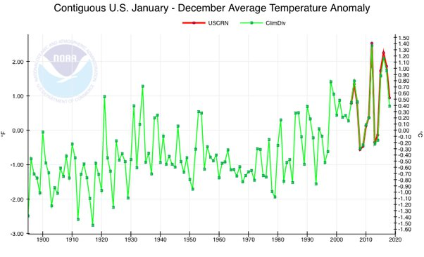

*Réponse publiée [sur Quora](https://fr.quora.com/Le-r%C3%A9seau-am%C3%A9ricain-de-r%C3%A9f%C3%A9rence-sur-le-climat-n-a-t-il-montr%C3%A9-aucun-nouveau-r%C3%A9chauffement-depuis-2005-aux-%C3%89tats-Unis/answer/Dr-Goulu)*

Non c'est faux.

Les mesures du réseau USCRN (qui ne couvre qu'une toute petite partie de la planète) sont parfaitement compatibles avec le réchauffement mesuré globalement.

[https://climatefeedback.org/clai...](https://climatefeedback.org/claimreview/claim-of-no-us-warming-since-2005-is-directly-contradicted-by-the-data-it-is-based-on/)
