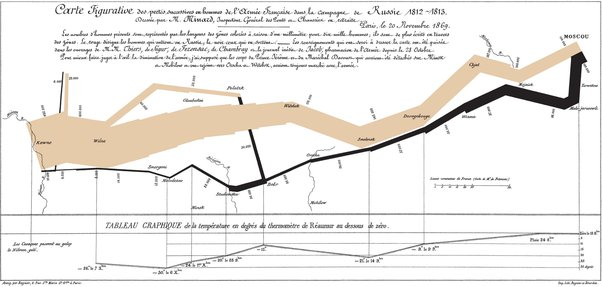

*Réponse publiée [sur Quora](https://fr.quora.com/Quel-est-le-graphique-le-plus-int%C3%A9ressant-que-vous-puissiez-nous-montrer/answer/Dr-Goulu)*

la [Carte figurative des pertes successives en hommes de l'armée française dans la campagne de Russie 1812-1813](w:)établie en 1869 par [Charles Minard](w:) :

C'est le premier "[Diagramme de Sankey](w:)", qui devraient donc s'appeler "diagrammes de Minard", mais il associe en plus des informations temporelles, géographiques et même thermométriques dans un graphique d'une lisibilité parfaite, qui vaut bien plus que mille mots.

Chaque fois que je le vois, j'ai la chair de poule en pensant à ce carnage.
