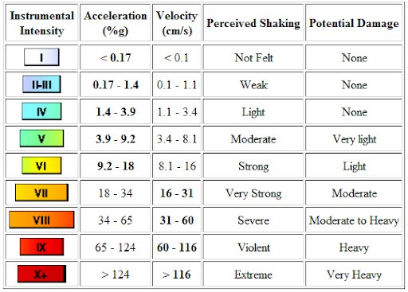

*Réponse publiée [sur Quora](https://fr.quora.com/Quelle-est-la-magnitude-selon-Richter-pour-un-seisme-ayant-une-acceleration-du-sol-de-04g/answer/Dr-Goulu)*

Environ VIII (en chiffres romaines) sur l'[Échelle Medvedev-Sponheuer-Karnik](w:) qui mesure les effets locaux, et que voici:

L'échelle de Richter n'est plus utilisée. Elle est remplacée par l'échelle de [magnitude de moment](w:) qui correspond à l'énergie dégagée à l'épicentre, et qui ne peut donc pas être reliée à une accélération du sol sans tenir compte de la distance, de la profondeur, de la géologie etc.

[https://www.drgoulu.com/2011/03/...](/2011/03/16/seismes-et-energies/)
