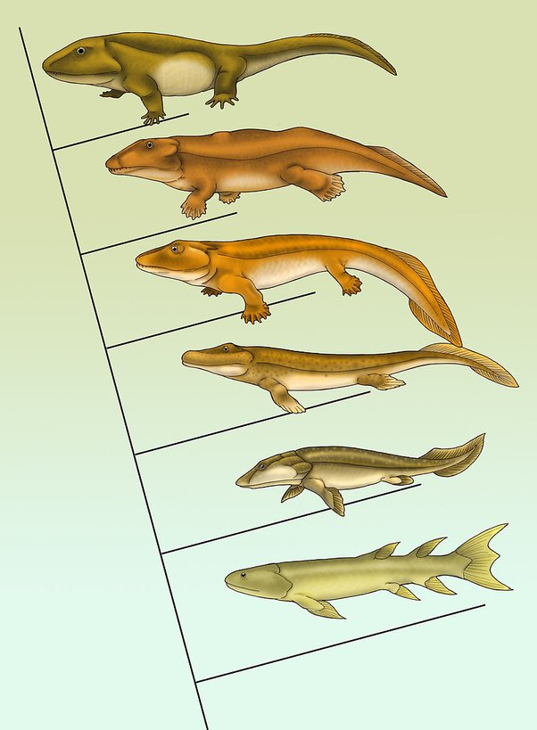

*Réponse publiée [sur Quora](https://fr.quora.com/Quel-est-lanc%C3%AAtre-commun-le-plus-r%C3%A9cent-des-reptiles-et-des-humains/answer/Dr-Goulu)*

Le terme [Reptile](w:)est peu clair du point de vue de la classification moderne basée sur la génétique. Par exemple, l'ancêtre commun des lézards et des crocodiles est aussi celui des oiseaux, et définit l'ordre des [Sauropsides](w:Sauropsida).

L'ordre de l'espèce Homo Sapiens est [Synapsida](w:), qui inclut tous les mammifères.

Donc votre question aurait pu être:

> Quel est l'ancêtre commun le plus récent du crocodile du Nil et des mammifères ?

ou

> Quel est l'ancêtre commun le plus récent des reptiles et des mammifères ?

ou encore

> Quel est l'ancêtre commun le plus récent des [Sauropsida](w:)et des [Synapsida](w:)?

La réponse aurait été la même : ce sont les [Amniotes](w:Amniota), des tétrapodes (= "quadrupèdes") sortis de l'eau en développant un sac amniotique dans lequel leurs embryons pouvaient se développer comme en milieu aqueux, au contraire des Amphibiens qui ont toujours besoin d'eau pour le développement de leurs rejetons.

Comme ça s'est passé il y a 385 à 350 millions d'années environ (35 millions d'années pour sortir de l'eau…) il ne reste pas beaucoup de fossiles et pas assez bien conservés pour pouvoir y distinguer notre ancêtre de ceux de branches éteintes, mais on connaît quand même quelques [Fossiles de transition](w:Forme_transitionnelle) :

de bas en haut : [Eusthenopteron](w:), [Panderichthys](w:), [Tiktaalik](w:), [Acanthostega](w:), [Ichthyostega](w:), [Pederpes](w:).

