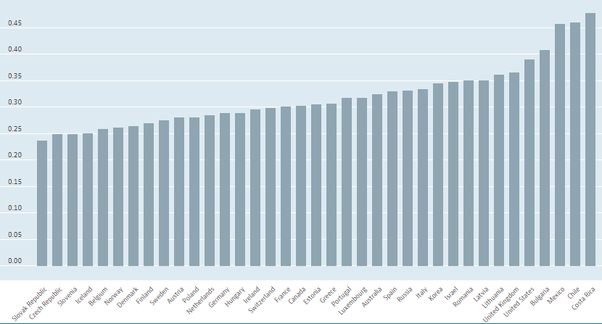
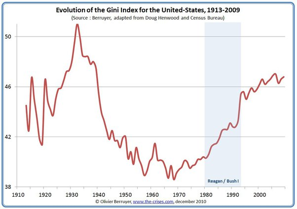

*Réponse publiée [sur Quora](https://fr.quora.com/Pensez-vous-que-notre-soci%C3%A9t%C3%A9-est-tr%C3%A8s-in%C3%A9galitaire-Si-oui-quelle-en-est-la-cause/answer/Dr-Goulu)*

la question provenant des USA, j'imagine que "notre société" concerne ce pays.

Alors, voici le classement des pays de l'OCDE selon le [Coefficient de Gini](w:), la mesure la plus communément utilisée pour la mesure des inégalités car elle tient compte de tous les revenus, pas seulement les x% maximum et minimum:

(source : [Inequality - Income inequality - OECD Data](https://data.oecd.org/inequality/income-inequality.htm) )

Donc oui, les Etats-Unis sont le pays le plus inégalitaire de l'OCDE, devancés uniquement par la Bulgarie, le Chili, le Mexique et le Costa-Rica.

Mais à l'inverse de certains de ces pays où l'égalité s'améliore, les inégalités augmentent aux USA et sont revenues au niveau des années 1930 …

