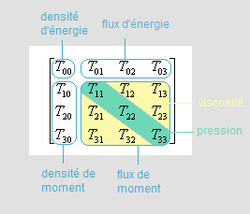

*Réponse publiée [sur Quora](https://fr.quora.com/Comment-le-temps-se-modifie-t-il-sous-leffet-dune-grande-masse-et-comment-cette-modification-explique-t-elle-la-d%C3%A9viation-de-la-lumi%C3%A8re-qui-en-r%C3%A9sulte/answer/Dr-Goulu)*

Comme ça :

$$R_{\mu \nu} \ - \ \frac{1}{2} \, g_{\mu \nu} \, R  \ + \ \Lambda \ g_{\mu \nu} \ =  \kappa T_{\mu \nu}$$

C'est l'[Équation d'Einstein](w:). Elle décrit exactement ce que vous dites, en beaucoup plus général car elle traite simultanément des "modifications" du temps et de l'espace en utilisant la notion de [Quadrivecteur](w:)d' [Espace-temps](w:)

En laissant tomber les termes correspondants à la [Courbure scalaire](w:) car notre univers est quasi plat, et la fameuse [Constante cosmologique](w:)qui n'a pas un rôle local, autour d'une grosse masse on peut simplifier l'équation en

$R_{\mu \nu} = \kappa T_{\mu \nu}$

où $T_{\mu \nu}$ est le [Tenseur énergie-impulsion](w:) qui a cette forme:

$T_{00}$ est la [Densité d'énergie](w:), donc c'est là que vous mettrez votre grande masse puisque $E=m.c^2$ et les autres termes qui décrivent si elle tourne et si elle rayonne, ce genre de choses.

vous faites les calculs avec la [Constante d'Einstein](w:)$\kappa=\frac{8{\pi}G}{c^4}$et vous obtenez les déformations de l'espace-temps dans R$_{\mu \nu}$ , le [Tenseur de Ricci](w:)

Là dedans vous allez trouver la [Dilatation du temps](w:) dans $T_{00}$, les dilatations de l'espace dans les 3 coordonnées dans $T_{11}, T_{22}, T_{33}$

Et plein d'effets tordus dans les termes non-diagonaux, comme l'[Effet Lense-Thirring](w:) qui enroule l'espace autour des masses qui tournent.

Mais peut-être que vous vouliez savoir comment ça se fait ? Je laisse Hubert Reeves vous répondre :

> La réaction d’un esprit non préparé est normalement : “je ne comprends pas.” En fait il n’y a rien à “comprendre”: voilà un énoncé qui représente un fait vérifié par l’expérience. On part de là; on n’y arrive pas après raisonnement. On constate le fait, comme on constate l’existence du monde, comme on constate sa propre existence.
> ( Hubert Reeves “[La théorie de la relativité](http://id.erudit.org/iderudit/59825ac)“, 1961, Liberté, 3(2), 490–492. [[pdf](http://www.erudit.org/culture/liberte1026896/liberte1430666/59825ac.pdf)] )
