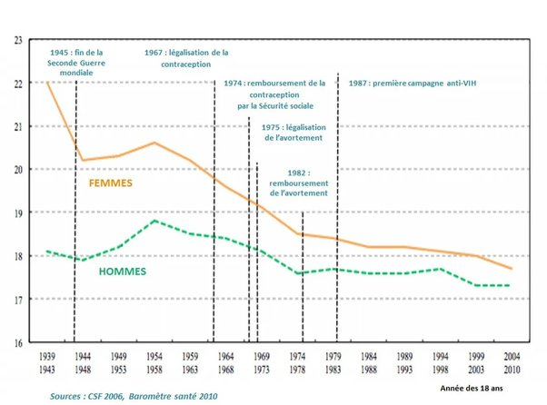

*Réponse publiée [sur Quora](https://fr.quora.com/Peut-on-aujourd-hui-encore-trouver-des-filles-vierges-ou-d-hommes-puceaux-avec-lesquelles-malgr%C3%A9-ce-que-notre-monde-est-devenu/answer/Dr-Goulu)*

Et le monde est devenu quoi d'après vous ?

[https://www.ined.fr/fr/tout-savo...](https://www.ined.fr/fr/tout-savoir-population/memos-demo/focus/l-age-au-premier-rapport-sexuel/)
