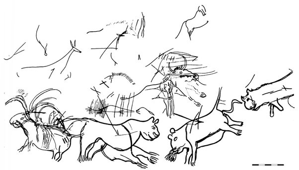

*Réponse publiée [sur Quora](https://fr.quora.com/Comment-les-hommes-pr%C3%A9historiques-survivaient-ils-aux-grands-carnivores-Les-affrontaient-ils/answer/Dr-Goulu)*

Non seulement ils les ont affrontés, mais ils ont peut-être contribué à leur extinction.

A Lascaux, le "diverticule des félins" représente des[Lions des cavernes](w:Lion_des_cavernes_d'Eurasie) percés de flèches et crachant

Comme par hasard, le [Smilodon](w:)ou "tigre à dents de sabre" a disparu en Amérique peu après l'arrivée des humains.
