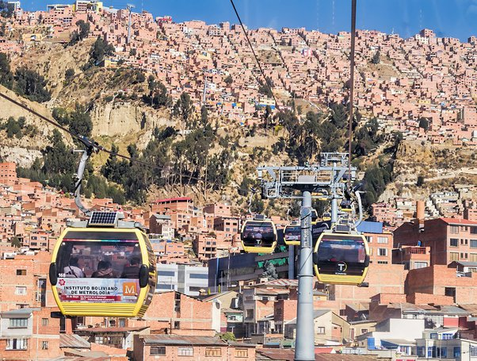
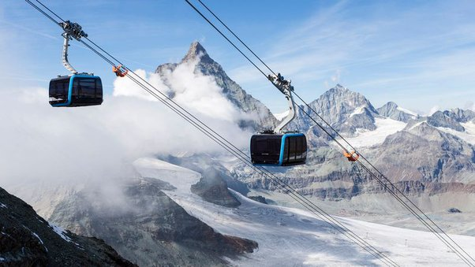

*Réponse publiée [sur Quora](https://fr.quora.com/L%C3%A9volution-humaine-ralentit-elle/answer/Dr-Goulu)*

On pourrait penser que la [Sélection de survie](w:)a diminué maintenant que nous n'avons plus de prédateurs et que la médecine produit en moins d'une année des vaccins contre de nouveaux virus, mais ce serait oublier l'autre aspect de la sélection naturelle, la [Sélection sexuelle](w:).

J'y ai pensé l'hiver passé. Dans le téléphérique qui monte au [Petit Cervin](w:)(3880m) j'ai rencontré un jeune couple en voyage de noces, lui suisse, elle bolivienne de La Paz. Elle était émerveillée par les glaciers, la neige, le Cervin (il y a de quoi…[[1]](#PmXMw) ) Je lui dis "pourtant c'est à la même altitude que les [télécabines de La Paz](w:Téléphérique_La_Paz_-_El_Alto)…" (qui relient le centre-ville à plusieurs quartiers)

Et en leur souhaitant tout le bonheur possible, j'ai pensé "avec le réchauffement climatique, peut-être que leurs petits-enfants pourront vivre ici, grâce à ses gènes d'adaptation à l'altitude…"[[2]](#GANlK)

photos prises à la même altitude …

Notes de bas de page

[[1]](#cite-PmXMw)[Obsédé par le Cervin - Pourquoi Comment Combien](/2012/02/19/cervin/)

[[2]](#cite-GANlK)[L'adaptation à l'altitude - Pourquoi Comment Combien](/2014/08/17/ladaptation-a-laltitude/)
