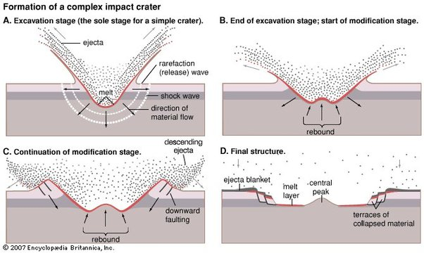

*Réponse publiée [sur Quora](https://fr.quora.com/Pourquoi-y-a-t-il-une-montagne-%C3%A0-lint%C3%A9rieur-du-crat%C3%A8re-Herschel-sur-Mimas/answer/Dr-Goulu)*

C'est typique des grands cratères, il y a par exemple [Odyssée](w:Odyssée_(cratère))sur la lune de Saturne Thetys.

C'est un rebond du sol à l'impact, un peu comme quand vous lâchez un caillou dans l'eau.

Ca arrive sur Terre aussi, mais l érosion rend ça moins visible.

Quoique

[https://www.drgoulu.com/2009/04/...](/2009/04/16/de-manicouagan-a-rochechouart/)

Et

[https://fr.wikipedia.org/wiki/As...](w:Astroblème_de_Rochechouart-Chassenon)
