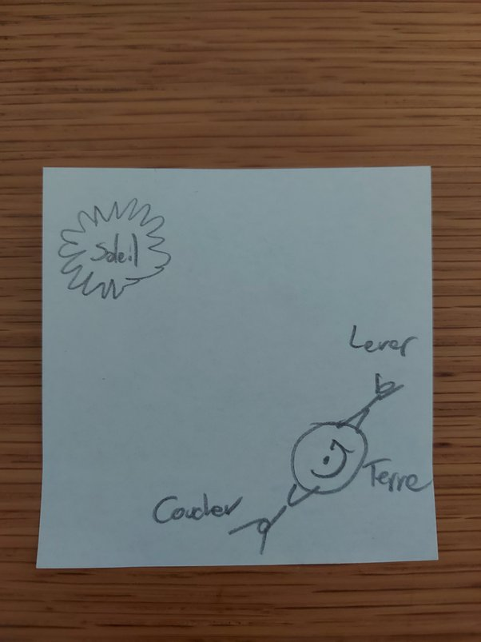

*Réponse publiée [sur Quora](https://fr.quora.com/Une-personne-situ%C3%A9e-%C3%A0-l-%C3%A9quateur-peut-elle-sauter-en-l-air-plus-haut-au-coucher-du-soleil-qu-%C3%A0-son-lever/answer/Dr-Goulu)*

Pourquoi pensez-vous ça ? Faites un petit dessin pour vous représenter la situation

Le mien ressemble à ça :

Il est très moche, mais je n'arrive quand même pas à imaginer pourquoi le bonhomme sauterait plus haut dans un cas que dans l'autre.

Si vous non plus, alors la réponse est non.
