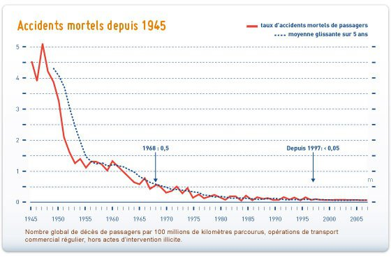

*Réponse publiée [sur Quora](https://fr.quora.com/Les-accidents-avec-les-centrales-nucl%C3%A9aires-vont-ils-sintensifier-%C3%A0-lavenir/answer/Dr-Goulu)*

Plutôt le contraire : avec chaque accident on apprend beaucoup, et il y a eu beaucoup [d'accidents nucléaires](w:Liste_d'accidents_nucléaires)de gravité variable.

l'[Agence internationale de l'énergie atomique](w:)fait à chaque fois un rapport complet et impose de nouvelles directives de sécurité au niveau mondial.

Par exemple, les centrales suisses du même type que celles de Fukushima ont été modifiées après l'accident[[1]](#YKMhc)

Dans l'aviation, la même démarche a permis de considérablement réduire les risques en quelques décennies. Voler aujourd'hui est 20x moins dangereux que qu'en 1960

Jusqu'ici, il n'y a pas vraiment eu d'accident nucléaire du au vieillissement des centrales, mais peut-être à leur conception ancienne. Raison pour laquelle il faut en construire de nouvelles. Il y a d'ailleurs actuellement 52 [réacteurs nucléaires en construction](w:Liste_de_réacteurs_nucléaires_en_construction)dans le monde, soit à peu près autant que tout le parc français…

Notes de bas de page

[[1]](#cite-YKMhc)[Dix ans après Fukushima (4/6) : les conséquences pour les centrales nucléaires suisses et l’autorité de surveillance » IFSN](https://www.ensi.ch/fr/2021/02/25/dix-ans-apres-fukushima-4-6-les-consequences-pour-les-centrales-nucleaires-suisses-et-lautorite-de-surveillance/)
