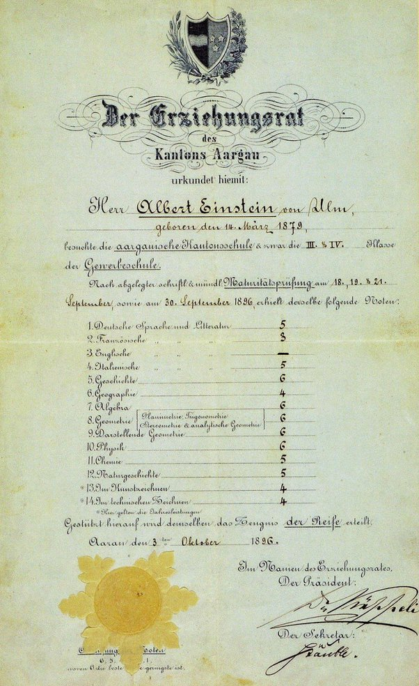

*Réponse publiée [sur Quora](https://fr.quora.com/Pourquoi-les-gens-pensent-ils-%C3%A0-tort-qu-Einstein-%C3%A9tait-mauvais-en-maths/answer/Dr-Goulu)*

Parce que les notes en Suisse allaient jusqu'à 6

Voici ses notes au bac ("Maturitätsprüfung") : 6 en maths et physique.

