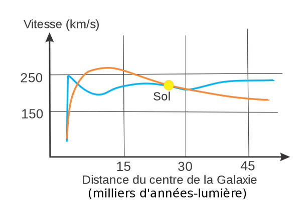

*Réponse publiée [sur Quora](https://fr.quora.com/Sait-on-calculer-la-vitesse-de-rotation-de-notre-galaxie-et-d%C3%A9terminer-si-cette-vitesse-est-sup%C3%A9rieure-%C3%A0-celle-attendue-tendant-%C3%A0-supposer-la-pr%C3%A9sence-de-mati%C3%A8re-noire-dans-notre/answer/Dr-Goulu)*

Pour compléter un peu la réponse laconique de [Benoît Morrissette](https://fr.quora.com/profile/Beno%C3%AEt-Morrissette), [Voie lactée — Wikipédia](w:Voie_lactée) donne ces courbes de rotation :

En bleu les valeurs mesurées, en orange les valeurs théoriques sans matière noire.

On voit que ça cloche.
