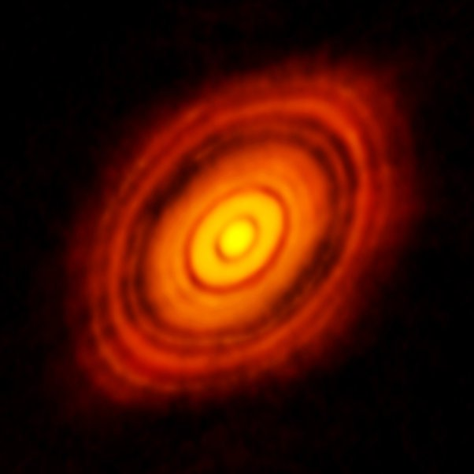

*Réponse publiée [sur Quora](https://fr.quora.com/Les-plan%C3%A8tes-gravitent-elles-toutes-sur-le-m%C3%AAme-plan-autour-du-Soleil-Si-oui-pourquoi-Et-quen-est-il-pour-les-%C3%A9toiles-dans-la-Voie-Lact%C3%A9e/answer/Dr-Goulu)*

Oui les planètes gravitent autour de leur étoile presque dans le même plan, et les étoiles dans les galaxies anciennes (= qui n'ont pas subi de collision dans les x derniers milliards d'années) tournent aussi presque dans le même plan.

La raison est la [Conservation du moment cinétique](w:)et le frottement : ce qui tourne continue à tourner autour du même axe, et les objets qui ne tournent pas sur le plan perpendiculaire à cet axe vont osciller de chaque côté du plan, ce qui va tôt ou tard leur faire heurter d'autres objets et se stabiliser dans le plan.

Ca va très vite, voire par exemple le [Disque protoplanétaire](w:)de HL Tauri, un système en cours de formation autour d'une étoile allumée il y a moins d'un million d'années :

