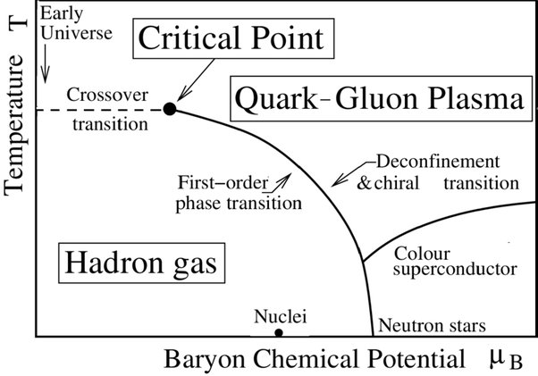

*Réponse publiée [sur Quora](https://fr.quora.com/Est-ce-que-les-quarks-sont-uniquement-dans-les-protons-et-neutrons-o%C3%B9-est-il-possible-de-les-trouver-autre-part/answer/Dr-Goulu)*

Dans le [Plasma quarks-gluons](w:)qui est l'état de la matière au dessus de 10^12 K environ.

C'est chaud. Ça correspond à la température de l'univers pendant les 20 ou 30 premières microsecondes après le Big Bang.

On arrive à reproduire cet état en tout petit et beaucoup moins longtemps dans les accélérateurs de particules depuis l'an 2000 seulement [1]

La théorie prédit également l'existence de quarks presque libres dans des [Étoiles étranges](w:Étoile_étrange), un type d'étoiles à neutrons à la limite de l'effondrement en trou noir. On en a pas identifié formellement, mais [PSR J0205+6449](w:) et [RX J1856.5-3754](w:) sont deux candidates considérées comme probables

Le "diagramme de phase chromodynamique" ci-dessous résumé les états de la matière des quarks.

(Source Wikipédia selon [2])

Références

1. [Ions lourds et plasma de quarks et de gluons](https://home.cern/fr/science/physics/heavy-ions-and-quark-gluon-plasma)
2. Rajeev S. Bhalerao(Tata Inst.) - 1st Asia-Europe-Pacific School of High-Energy Physics (AEPSHEP 2012), pp. 219-239 Relativistic heavy-ion collisions DOI: 10.5170/CERN-2014-001.219
