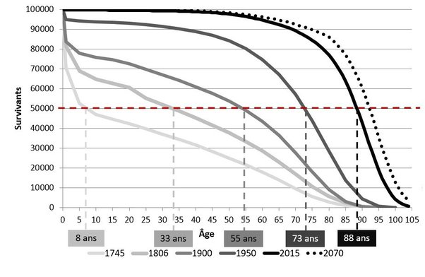

*Réponse publiée [sur Quora](https://fr.quora.com/Jusqu-%C3%A0-quel-%C3%A2ge-l-%C3%AAtre-humain-pourrait-il-vivre-avec-la-m%C3%A9decine-d-aujourd-hui-sans-tous-les-%C3%A9l%C3%A9ments-n%C3%A9fastes-pour-lui-alcool-tabac-pollution-des-villes-et-dans-des-conditions-tr%C3%A8s/answer/Dr-Goulu)*

La réponse se trouve dans l'évolution des [Courbes de survie](w:Courbe_de_survie), qui indique la proportion des gens survivant à chaque âge

Voici celles de la France à différentes époques :

Ce que vous voyez, c'est que quand les villes n'étaient pas polluées, que tout le monde avait des "conditions très saines (activités physiques, alimentation bio, en autarcie)", par exemple en 1745, ben la moitié des gens mourraient avant l'âge de 8 ans.

Ensuite, vers 1806 quand cet âge de survie médian (ce n'est pas tout à fait ce qu'on appelle l'espérance de vie, mais pas très différent quand même) à atteint 33 ans, c'est surtout grâce à une meilleure survie des jeunes enfants grâce à une hygiène un peu meilleure, notamment de l'eau plus propre, , mais après 20 ans la mortalité augmente brutalement : guerres, mortes en couches etc.

Aujourd'hui, avec tous les maux que vous mentionnez, on a une chance sur deux d'atteindre 88 ans, et la courbe ne montre quasiment plus de discontinuité révélant un risque particulier à un âge donné. La courbe se "rectangularise" et se trouve déjà très proche de celle imaginée pour 2070, où la moitié des gens devraient atteindre 92 ans, et 10% 100 ans.
