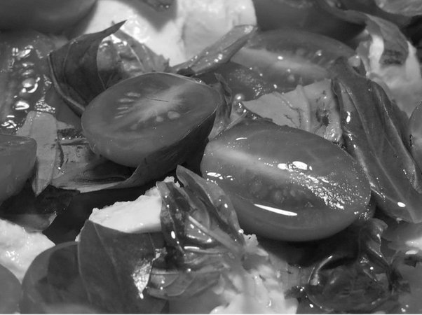

*Réponse publiée [sur Quora](https://fr.quora.com/%C3%80-quoi-cela-nous-sert-de-distinguer-les-couleurs-Ce-n-est-pas-forc%C3%A9ment-n%C3%A9cessaire-%C3%A0-notre-survie-alors-pourquoi-avons-nous-quand-m%C3%AAme-la-capacit%C3%A9-de-les-voir/answer/Dr-Goulu)*

C'était super utile à notre survie de distinguer les fruits murs des verts, et un léopard dans le feuillage, et pour notre reproduction de distinguer une belle peau bien saine chez un(e) partenaire d'une jaunisse.

Juste pour illustrer : qu'est-ce qui se mange là dedans ?

