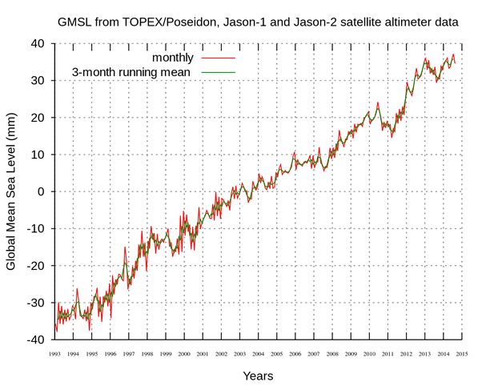
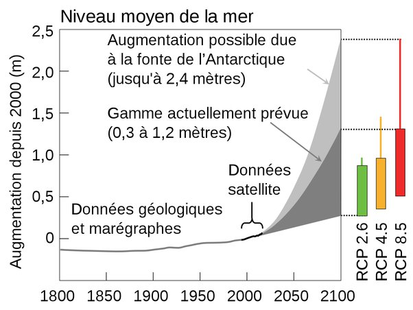

*Réponse publiée [sur Quora](https://fr.quora.com/Selon-des-%C3%A9tudes-le-niveau-de-la-mer-se-serait-%C3%A9lev%C3%A9-de-178mm-a-cause-du-r%C3%A9chauffement-climatique-ce-n-est-pas-autant-que-les-58-m%C3%A8tres-annonc%C3%A9s-non/answer/Dr-Goulu)*

absolument personne n'a annoncé 58m, et 17.8 mm n'a pas de sens si on indique pas la période ni l'endroit.

L'[Élévation du niveau de la mer](w:) mesurée globalement par satellite est d'environ 70mm en 22 ans

la suite va beaucoup dépendre du réchauffement climatique, mais sera vraisemblablement de l'ordre du mètre d'ici la fin du siècle, et sans le moindre point d'inflexion en vue on peut tabler sur plusieurs mètres au siècle prochain.

