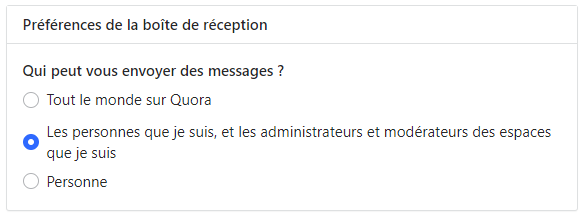

*Réponse publiée [sur Quora](https://fr.quora.com/Je-ne-parviens-pas-%C3%A0-envoyer-des-messages-sur-Quora-Lorsque-je-tape-le-nom-de-mon-destinataire-dans-la-barre-Syst%C3%A9matiquement-elle-ne-trouve-pas-la-personne-Est-ce-moi-qui-suis-teub%C3%A9-ou/answer/Dr-Goulu)*

vous ne pouvez envoyer des messages à n'importe qui. Chacun peut choisir dans ses paramètres :

Par exemple, tant que je ne vous suis pas, vous ne pouvez pas m'envoyer de messages
