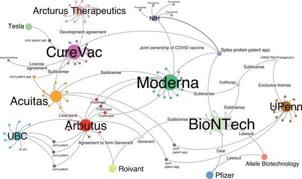

*Réponse publiée [sur Quora](https://fr.quora.com/Pourquoi-ne-pas-rendre-publics-les-brevets-des-vaccins-anti-Covid-19-afin-de-mieux-ma%C3%AEtriser-la-pand%C3%A9mie/answer/Dr-Goulu)*

- les brevets sont par définition publics. Vous pouvez tous les trouver sur Google Patents, par exemple : [https://patents.google.com/paten...](https://patents.google.com/patent/US10703789B2)
- un brevet interdit à quelqu'un d'autre d'utiliser votre invention, mais ne vous donne pas forcément le droit de l'utiliser car vous pouvez enfreindre d'autres brevets… Donc le système favorise les accords et les collaborations, comme le montre ce joli graphe tiré de [A network analysis of COVID-19 mRNA vaccine patents - Nature Biotechnology](https://www.nature.com/articles/s41587-021-00912-9) :

- certains pays ont des lois leur permettant de nationaliser/réquisitionner des brevets en cas de force majeure.
- encore faut-il avoir les moyens de produire de grandes quantités de vaccins à un prix compétitif. Ca ne se fait pas en quelques semaines …
- enfin, n'oublions pas que le taux d'échec en pharma est élevé. Si on prive les entreprises de leur benef en cas de succès, elles n'auront peut-être pas les moyens ni l'envie de développer d'autres traitements …
