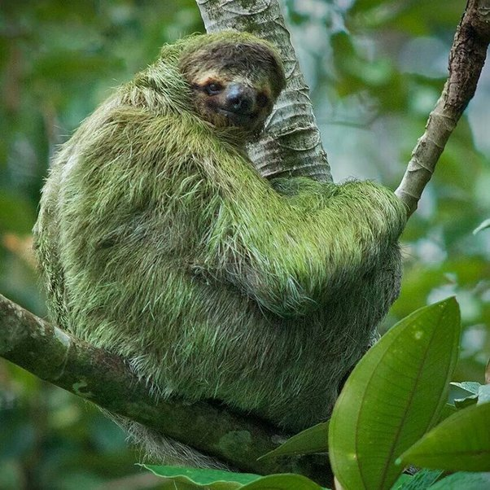

*Réponse publiée [sur Quora](https://fr.quora.com/Si-les-animaux-sauvages-%C3%A0-la-fois-pr%C3%A9dateurs-et-proies-ont-adapt%C3%A9-leur-apparence-pour-devenir-un-camouflage-dans-leurs-habitats-naturels-pourquoi-aucun-d-entre-eux-n-est-vert/answer/Dr-Goulu)*

Outre les insectes, reptiles et batraciens déjà mentionnés dans d'autres réponse, il y a mon préféré :

