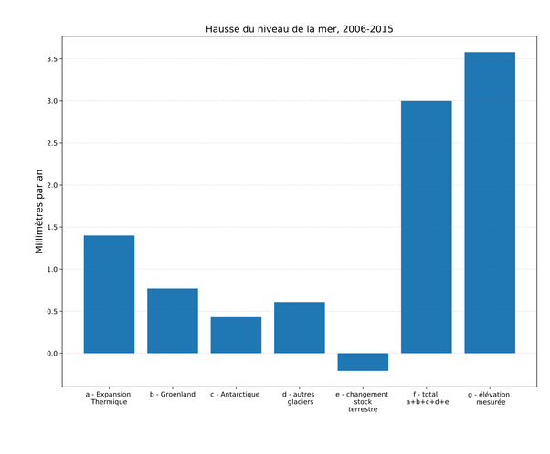

*Réponse publiée [sur Quora](https://fr.quora.com/Pourquoi-ne-pas-construire-une-digue-autour-de-l-Antarctique-pour-pr%C3%A9server-le-reste-du-monde-de-la-mont%C3%A9e-des-eaux/answer/Dr-Goulu)*

La fonte des glaces de l'Antarctique ne représente que moins d'un cinquièmes de l'[Élévation du niveau de la mer](w:).

La moitié est due à la dilatation de l'eau qui s'échauffe, et plus d'un quart à la fonte du Groenland

(source : [Climate Change 2021: The Physical Science Basis](https://www.ipcc.ch/report/sixth-assessment-report-working-group-i/) )
