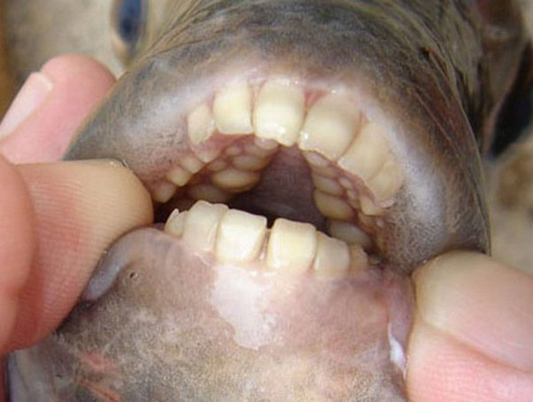

*Réponse publiée [sur Quora](https://fr.quora.com/Pourquoi-y-a-t-il-des-poissons-avec-les-m%C3%AAmes-dents-que-les-humains/answer/Dr-Goulu)*

Parce que vous n'y connaissez rien en dents de poissons, ni en dents humaines.

[Archosargus probatocephalus](w:)a des dents qui ressemblent un tout petit peu à celles du mouton, ce qui fait qu'on l'appelle communément "rondeau mouton"

> outre des [incisives](w:Incisive) à l’avant de la mâchoire, il possède plusieurs rangées de molaires — trois sur la mâchoire supérieure et deux sur la mâchoire inférieure — qui lui permettent de broyer sa nourriture, constituée essentiellement de [mollusques](w:Mollusque) et de [crustacés](w:)

Certains trouvent même que ses dents ont l'air humaines, mais quand on y regarde de près, c'est très différent.

