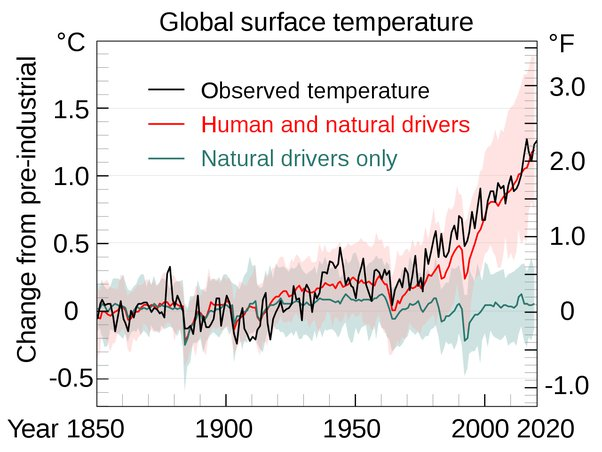

*Réponse publiée [sur Quora](https://fr.quora.com/Quel-est-le-principal-facteur-du-changement-climatique-terrestre/answer/Dr-Goulu)*

Nos émissions de gaz à effet de serre.

Depuis une vingtaine d'années il n'y a plus de doute : les marges d'erreur ne permettent plus d'attribuer ce réchauffement à des causes naturelles.

[Attribution du changement climatique récent — Wikipédia](w:Attribution_du_changement_climatique_récent)

