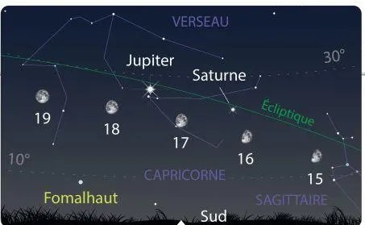

*Réponse publiée [sur Quora](https://fr.quora.com/Jupiter-est-si-grand-Pourquoi-je-ne-le-vois-pas-sur-terre/answer/Dr-Goulu)*

Parce que vous ne savez pas où regarder, mais on la voit très bien.

Ces prochains jours, vous pouvez observer Jupiter et Saturne vers 23h plein Sud, 25° au dessus de l'horizon, pas loin de la Lune :

(source : [Carte du ciel de septembre 2021 : la Lune rend visite à Saturne et à Jupiter](https://fr.news.yahoo.com/carte-ciel-septembre-2021-lune-150459508.html) )

Et avec de bonnes jumelles, on voit ses 4 [satellites principaux, comme Galilée les a vus en 1610](w:Satellites_galiléens), et les anneaux de Saturne.
