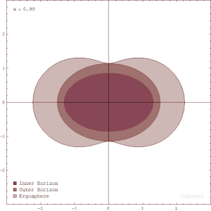

*Réponse publiée [sur Quora](https://fr.quora.com/Pourquoi-dans-lunivers-tout-est-de-forme-circulaire-orbite-plan%C3%A8te-%C3%A9toile-trou-noirs-etc/answer/Dr-Goulu)*

plusieurs phénomènes distincts, qui d'ailleurs produisent des "formes" distinctes aussi :

- les gros objets en un seul morceau sont (quasi) sphériques en raison de l'[Équilibre hydrostatique](w:)
- les orbites sont elliptiques (et non circulaires) et plus généralement des [Coniques](w:Conique)car ce sont les solutions des équations différentielles liées au mouvement dans un champ gravitationnel 3D. (en relativité "4D" ce n'est plus vrai, les trajectoires sont plus compliquées)
- les objets "en plusieurs morceaux" comme les galaxies, les anneaux, les disques d'accrétion etc ont des formes plus ou moins en disque en raison de la [Conservation du moment cinétique](w:) et du frottement : ce qui ne tourne pas dans le plan perpendiculaire à l'axe principal de rotation va interagir et tendre à tourner dans le plan en question.
- les trous noirs ne sont "de forme circulaire" que dans des visions très simplifiées. En réalité ils tournent extrêmement vite, à la limite imposée par la [Censure cosmique](w:)qui empêche tout juste de voir leur "singularité nue" qui est en forme d'anneau. Leur "horizon extérieur" a donc une forme de beignet :

