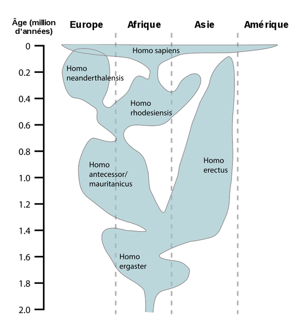

*Réponse publiée [sur Quora](https://fr.quora.com/Comment-se-fait-il-que-la-seule-esp%C3%A8ce-la-plus-proche-des-homo-sapiens-soit-les-chimpanz%C3%A9s-8-millions-d-ann%C3%A9es-mais-qu-il-n-existe-aucune-autre-esp%C3%A8ce-homo-plus-r%C3%A9cente-encore-vivante/answer/Dr-Goulu)*

Cette figure de la page [Homo — Wikipédia](w:Homo) donne une idée de ce qui s'est passé. Il y a eu plusieurs [migrations humaines hors d'Afrique](w:Premières_migrations_humaines_hors_d'Afrique) successives qui ont donnée naissance à des (sous-) espèces de Homo par isolement géographique et génétique.

Lors de la dernière qui a donné naissance à l'[Expansion planétaire de l'Homme moderne](w:), il y a eu des compétitions fatales aux populations en place et/ou des [Hybridations, notamment entre Sapiens, Neandertal et Denisova](w:Hybridation_entre_les_humains_archaïques_et_modernes)

