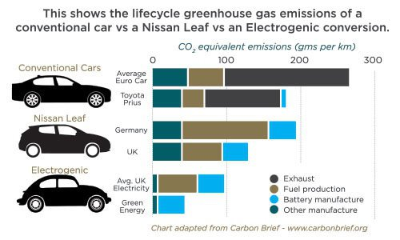

*Réponse publiée [sur Quora](https://fr.quora.com/La-g%C3%A9n%C3%A9ralisation-des-voitures-%C3%A9lectriques-est-elle-une-aberration-%C3%A9conomique-et-%C3%A9cologique/answer/Dr-Goulu)*

On verra. Ça dépendra de la source de l'électricité et de la technologie des batteries. Mais ça ne sera pas pire que le pétrole.

