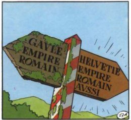

*Réponse publiée [sur Quora](https://fr.quora.com/Paris-est-elle-plus-sale-et-moins-s%C3%BBre-qu-auparavant/answer/Dr-Goulu)*

La qualité de l'air s'est très nettement améliorée :

[https://www.paris.fr/pages/etat-...](https://www.paris.fr/pages/etat-des-lieux-de-la-qualite-de-l-air-a-paris-7101)

La qualité de l'eau s'est très nettement améliorée :

[http://www.eau-seine-normandie.f...](http://www.eau-seine-normandie.fr/sites/public_file/docutheque/2017-03/plaquette_50_ans_efforts.pdf)

Il me semble que je marche nettement moins souvent dans des m… de chien que dans les années 80. Bravo !

Cela dit, la suppression des géniales inventions d'[Eugène Poubelle](w:)pour cause de plan vigipirate me cause un réel problème : je me ballade avec plein de détritus dans les poches, mais c'est plus fort que moi…

