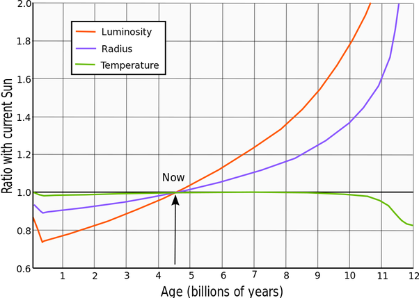

*Réponse publiée [sur Quora](https://fr.quora.com/Lorsque-le-Soleil-%C3%A9tait-en-formation-et-avant-les-r%C3%A9actions-nucl%C3%A9aires-%C3%A0-lint%C3%A9rieur-du-noyau-quelle-aurait-d%C3%BB-%C3%AAtre-sa-temp%C3%A9rature-de-surface/answer/Dr-Goulu)*

Selon [Formation et évolution du Système solaire — Wikipédia](w:Formation_et_évolution_du_Système_solaire), le soleil était alors une [Étoile variable de type T Tauri](w:).

Étonnamment ces "étoiles" où la fusion n'a pas encore démarré ont une température de surface proche de celle des étoiles de la séquence principale de même masse. Elles sont chauffées par l'énergie gravitationnelle libérée par l'effondrement du nuage moléculaire d'origine.

D'ailleurs ça se voit tout à gauche du diagramme de son évolution : dans les premiers millions d'années, le soleil se contracte et sa luminosité baisse, mais la température reste quasi constante..

Donc disons 5500 K.
