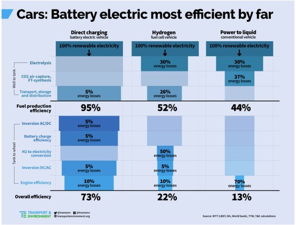

*Réponse publiée [sur Quora](https://fr.quora.com/Pourquoi-la-France-se-concentre-plus-sur-la-fabrication-de-voitures-%C3%A9lectriques-%C3%A0-batteries-plut%C3%B4t-que-celle-des-voitures-thermique-%C3%A0-hydrog%C3%A8ne/answer/Dr-Goulu)*

Parce que c'est 3x plus efficace

