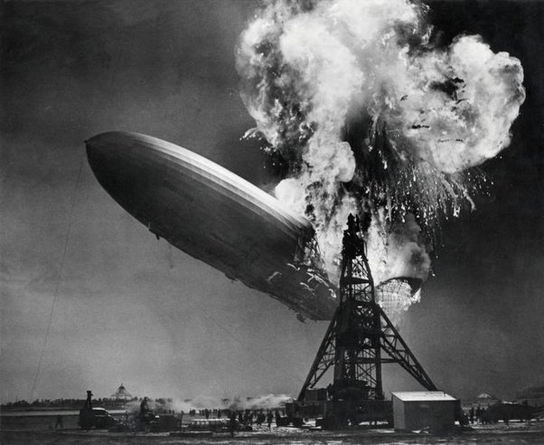
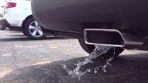

*Réponse publiée [sur Quora](https://fr.quora.com/Apr%C3%A8s-avoir-trouv%C3%A9-la-formule-de-l-eau-pouvons-nous-%C3%AAtre-en-mesure-de-la-cr%C3%A9er/answer/Dr-Goulu)*

Machines à créer de l'eau :

avec le passage à la voiture électrique, on produira moins d'eau …
