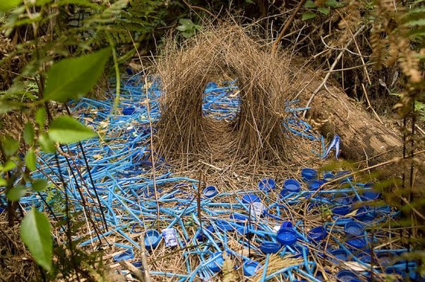

*Réponse publiée [sur Quora](https://fr.quora.com/Y-a-t-il-d-autres-esp%C3%A8ces-que-l-homme-qui-collectionnent-des-choses/answer/Dr-Goulu)*

Le [Jardinier satiné](w:) mâle construit un "berceau d'apparat" pour attirer les femelles. Il le décore avec des objets très colorés, de préférence bleus.

La pollution par les plastiques est une bénédiction pour lui

( source . [L'oiseau qui peint ses nids en bleu](https://www.instantculture.fr/2020/10/31/loiseau-qui-decore-ses-nids-en-bleu/) )
