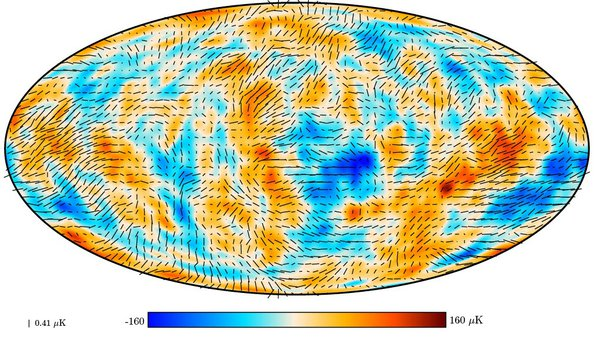

*Réponse publiée [sur Quora](https://fr.quora.com/Que-repr%C3%A9sentent-les-taches-noires-sur-la-photo-fournie-par-le-satellite-Planck/answer/Dr-Goulu)*

Le lien fourni dans les commentaires de la question correspond à cette image:

C'est la désormais célèbre image du [Fond diffus cosmologique](w:)(CMB) prise par Planck, version 2018

Selon

[https://cds.cern.ch/record/26363...](https://cds.cern.ch/record/2636310/plots)

les traits noirs indiquent la direction et l'intensité de la polarisation des ondes électromagnétiques correspondantes. Elles renseignent sur les sources d'[anisotropie tardives du CMB](w:Fond_diffus_cosmologique). Selon Wikipédia :

> - la physique des photons [diffusés par les électrons](w:Diffusion_Thomson) induit des anisotropies polarisées sur de grandes échelles angulaires. Cette polarisation angulaire est corrélée à la perturbation de la température grand angle.
> …
> - Des mesures confirment que dans l'[infrarouge](w:), le spectre électromagnétique du CMB ne présente aucune polarisation

(après prise en compte de l'effet "thermique" au premier point.)

Note : j'ai un léger doute en voyant que la légende de la figure indique un petit trait noir avec la mention "0.41 uK" à gauche … Ca pourrait être plutôt une indication du gradient du CMB, mais en vertu du point 1 ça revient au même que la polarisation …
